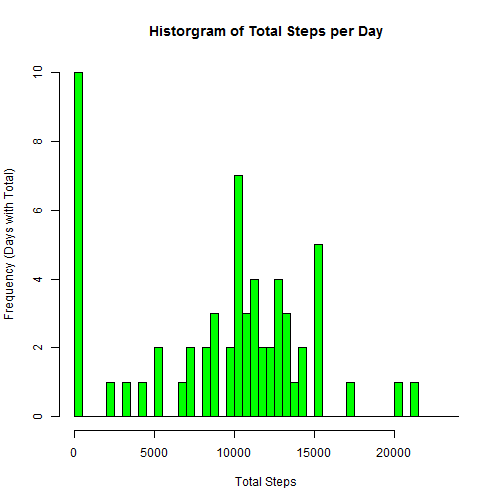
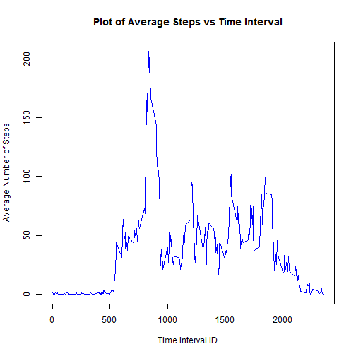
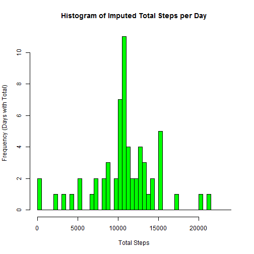
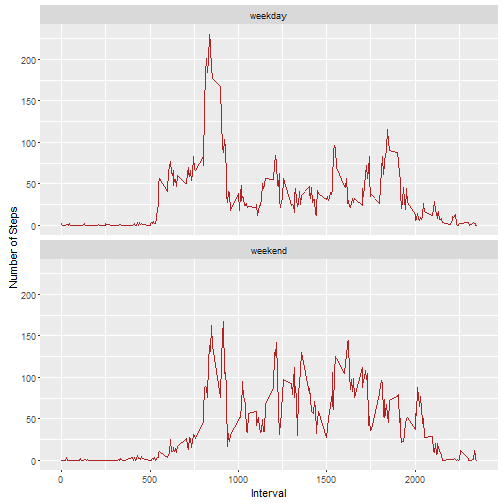

## Reproducible Research: Peer Assessment 1

### Loading and preprocessing the data
Show the code needed to:  
1 Load the Data  
2 Process/Transform to a format suitable for analysis  

```r
unzip("activity.zip")
df <- read.csv("activity.csv")
df$date <- as.Date(df$date,'%Y-%m-%d')
```

### What is mean total number of steps taken per day?
1 Calculate total number of steps taken per day  
2 Make a histogram of the total number of steps per day   
3 Calculate and report the mean and median of total steps per day    

```r
#-- 1
tot <- data.frame(date=unique(df$date),
                  steps= tapply(df$steps,df$date,sum,na.rm=TRUE))
#-- 2
hist(tot$steps,breaks=seq(0,24000,500),freq=TRUE,col="green",
      main="Historgram of Total Steps per Day",
      xlab = "Total Steps",
      ylab = "Frequency (Days with Total)")
```



```r
#-- 3
t_mean <- as.integer(round(mean(tot$steps)))
t_median <- as.integer(median(tot$steps))
```
The mean of total steps per day = 9354    
The median of total steps per day = 10395  

### What is the average daily activity pattern?
1 Plot of time series vs average number steps over all days
2 Which 5 minute interval has max average number of steps?

```r
#-- 1
avg <- data.frame(time = unique(df$interval),
                  steps= tapply(df$steps,df$interval,mean,na.rm=TRUE))
plot(avg$time,avg$steps,type="l",col="blue",
     main="Plot of Average Steps vs Time Interval",
     xlab="Time Interval ID",
     ylab="Average Number of Steps") 
```



```r
#-- 2
max_interval <- avg[avg$steps == max(avg$steps),1]
```
The interval ID with max number of average steps is: 835  

### Imputing missing values
1 Calculate and report the total number of missing values (NA)    
2 Devise a strategy for imputing missing values  
3 Create a data set with missing values filled in  
4 Create Histogram of avg steps per day b)
5 Calculate median and mean 

```r
#-- 1
num_na <- sum(is.na(df$steps))
#-- 2
# Will be using average steps over the 5-minute interval  
# as the strategy to impute substitute values for NA's
#-- 3
new_df <- read.csv("activity.csv")
new_df$date <- as.Date(new_df$date,'%Y-%m-%d')
for (i in 1:nrow(new_df)) {
  if (is.na(new_df$steps[i])) {
    new_df$steps[i] <- round(avg[new_df$interval[i] == avg$time,2])
  }  
}  
#-- 4
tot2 <- data.frame(date=unique(new_df$date),
                  steps= tapply(new_df$steps,new_df$date,sum))
hist(tot2$steps,breaks=seq(0,24000,500),freq=TRUE,col="green",
     main="Histogram of Imputed Total Steps per Day",
     xlab = "Total Steps",
     ylab = "Frequency (Days with Total)")
```



```r
#-- 5
t_mean2 <- as.integer(round(mean(tot2$steps)))
t_median2 <- as.integer(median(tot2$steps))
```
The total number of missing values = 2304   
The mean of imputed steps per day = 10766    
The median of imputed steps per day = 10762  
Yes the values do differ from first estimate.  
The impact of imputing, is to center data more around the mean.  
  


### Are there differences in activity patterns between weekdays and weekends?
1 Create new variable in new data frame for weekday and weekend  
2 Make panel plot of time series for total steps for weekday and weekend  

```r
#-- 1
wk_day <- c("Monday","Tuesday","Wednesday","Thursday","Friday")
new_df$wk_day <- factor((weekdays(new_df$date) %in% wk_day),
                        levels=c(FALSE,TRUE),
                        labels=c("weekend","weekday"))
#-- 2
wkday <- new_df[new_df$wk_day == "weekday",]
wkend <- new_df[new_df$wk_day == "weekend",]
avg_wkday<- data.frame(time = unique(wkday$interval),
                       steps= tapply(wkday$steps,wkday$interval,mean))
for (i in range(1:length(avg_wkday))) {
  avg_wkday$day_type[i] <- "weekday"
}
avg_wkend<- data.frame(time = unique(wkend$interval),
                       steps= tapply(wkend$steps,wkend$interval,mean))
for (i in range(1:length(avg_wkend))) {
  avg_wkend$day_type[i] <- "weekend"
}
avg_wk <- rbind(avg_wkday,avg_wkend)

                
library(ggplot2)
g <- ggplot(avg_wk,aes(time,steps))+geom_line(color="firebrick")+
       facet_wrap(~day_type,ncol=1)+
       labs(x="Interval",y="Number of Steps")
  
print(g)
```


